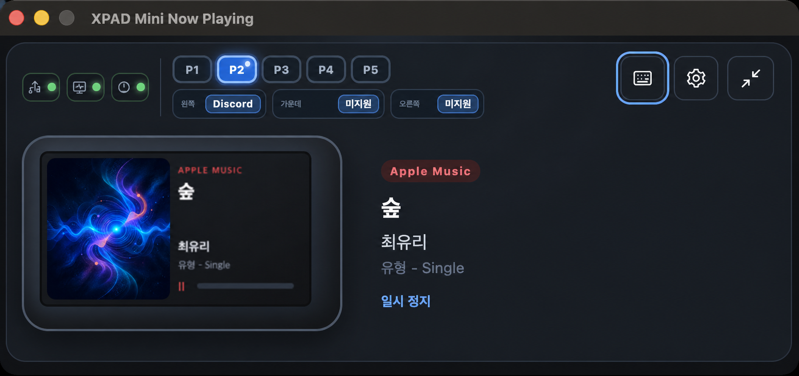
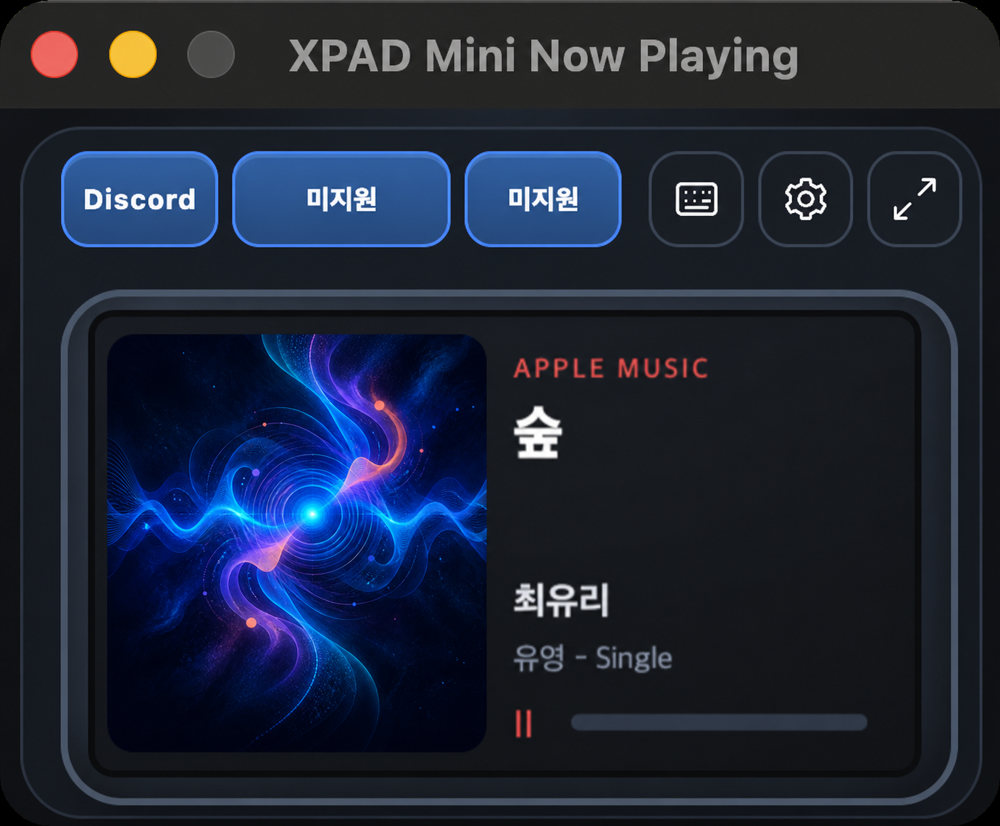
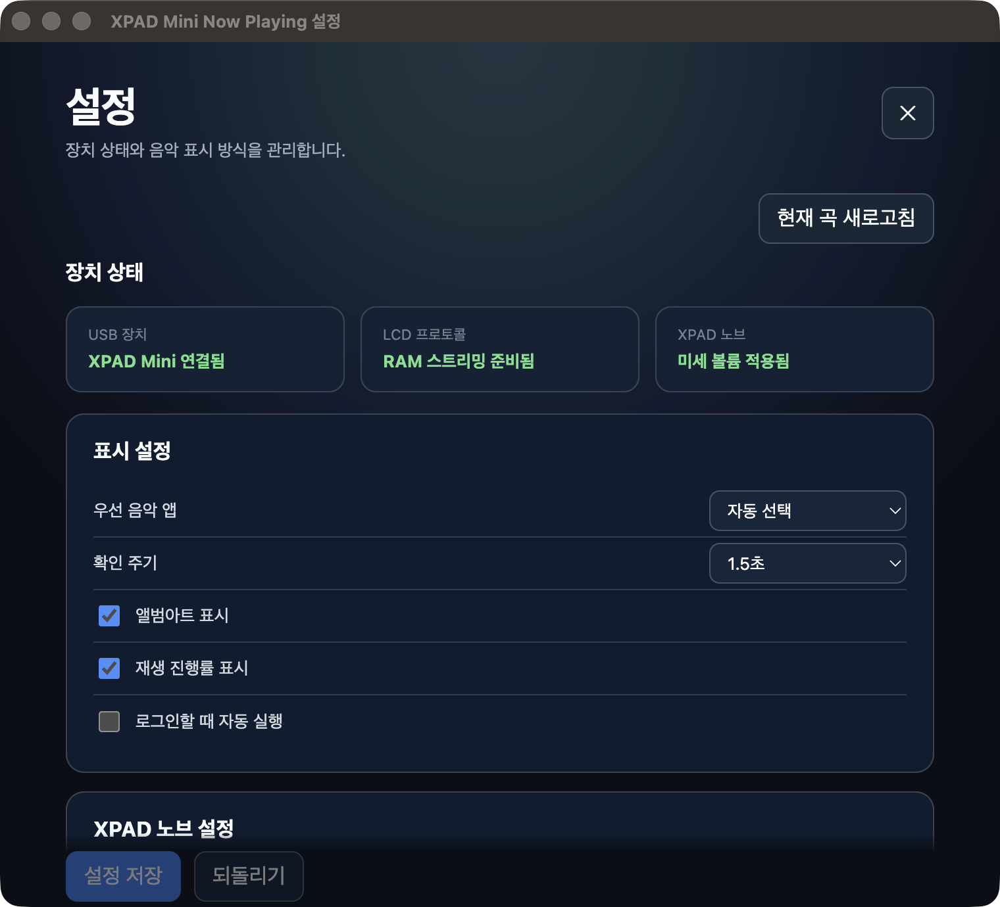
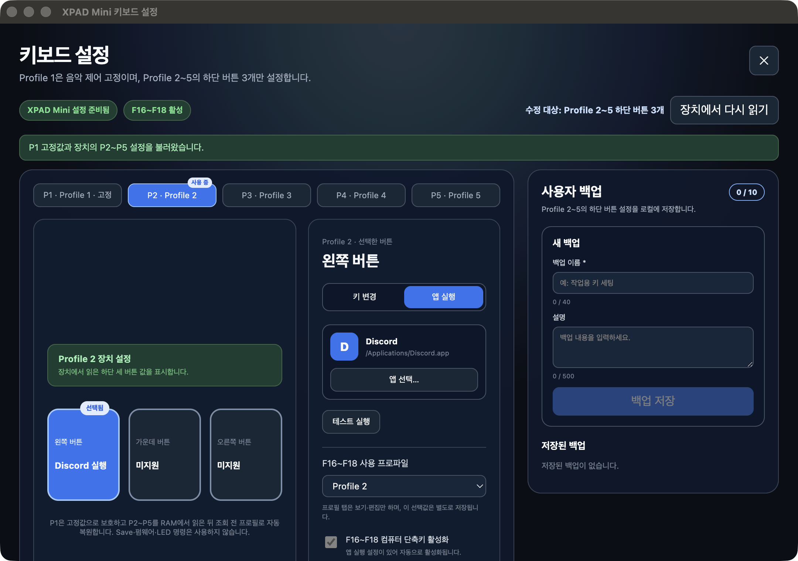
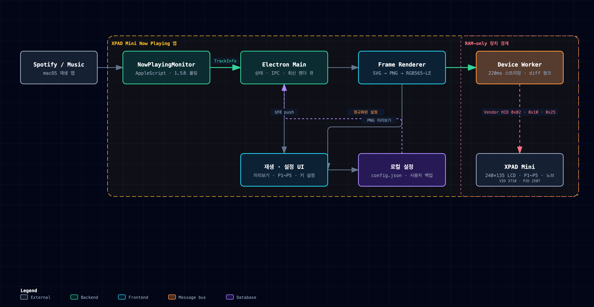
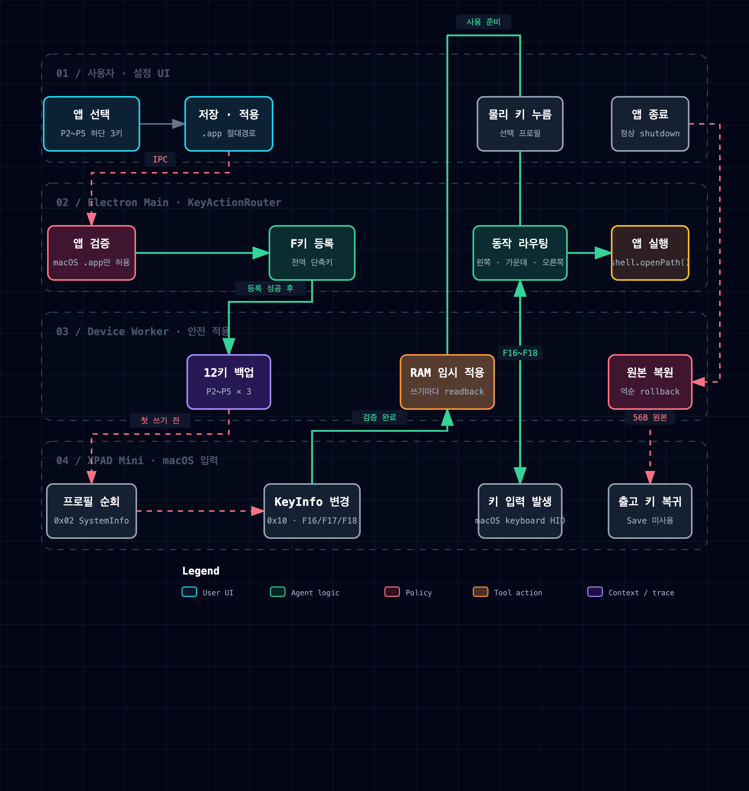

# XPAD Mini Now Playing

macOS의 Spotify와 Apple Music 재생 정보를 읽어 Pulsar Lab XPAD Mini의 240×135 LCD에 표시하고, P1~P5 프로필과 하단 3키를 음악 제어·앱 실행에 연결하는 Electron 트레이 앱입니다.

<p align="center">
  
</p>

> LCD 전송, 프로필 선택, 앱 실행용 임시 키 매핑은 모두 RAM에서만 수행합니다. Save·플래시·펌웨어·LED 명령은 사용하지 않으며 앱 종료 시 임시 키와 노브 원본을 복원합니다.

## 이 앱이 하는 일

- Spotify / Apple Music을 자동 감지해 곡명·아티스트·앨범·앨범아트·재생 상태·진행률을 표시합니다.
- 화면과 동일한 240×135 프레임을 XPAD Mini LCD에 약 220ms 간격으로 유지 전송합니다.
- 확장뷰에서는 음악 정보, 장치 상태, P1~P5와 현재 프로필의 하단 3키 동작을 한눈에 봅니다.
- 미니뷰에서는 실제 LCD 프레임과 자주 쓰는 3키·키보드 설정·일반 설정만 작게 유지합니다.
- P1은 이전 곡·재생/일시정지·다음 곡으로 고정하고, P2~P5의 하단 3키에는 앱 실행 동작을 연결할 수 있습니다.
- XPAD 노브 한 칸을 macOS 실제 출력 단계에 맞춘 미세 볼륨으로 사용하고, 조절 결과를 LCD와 미리보기에 표시합니다.
- 장치 분리·재연결, 앱 로그인 시 실행, 키 설정 사용자 백업을 지원합니다.

## 화면 둘러보기

### 확장뷰와 미니뷰

| 확장뷰 | 미니뷰 |
| --- | --- |
| 음악 메타데이터, 장치 상태, P1~P5와 현재 키 동작을 함께 표시합니다. | LCD 비율을 유지한 채 재생 화면과 핵심 버튼만 300×248 포인트 창에 배치합니다. |
|  |  |

상단의 대각선 화살표 버튼으로 확장뷰와 미니뷰를 전환합니다. 미니뷰의 버튼 라벨이 길면 버튼 폭 안에서 말줄임 처리되어 플레이어 영역을 침범하지 않습니다.

재생 화면은 실제 앱 UI를 기준으로 캡처했으며, 문서에 노출되는 앨범 이미지만 아래의 AI 생성 샘플 아트로 교체했습니다.

### 일반 설정

<p align="center">
  
</p>

일반 설정에서 우선 음악 앱, 확인 주기, 앨범아트·진행률 표시, 로그인 시 자동 실행, XPAD 노브 미세 볼륨을 관리합니다. 상단 상태 카드로 USB 연결, LCD 프로토콜, 노브 적용 여부를 즉시 확인할 수 있습니다.

### 키보드 설정

<p align="center">
  
</p>

키보드 설정은 장치에서 P2~P5의 하단 3키를 읽어 프로필별로 보여줍니다. 앱 실행을 선택하면 `.app` 절대 경로와 아이콘을 저장하고 해당 슬롯만 F16~F18로 임시 연결합니다. 설정은 이름·설명과 함께 최대 10개까지 로컬 백업할 수 있습니다.

## 샘플 음악과 앨범아트

아래 앨범은 문서용으로 만든 가상의 음악 샘플입니다. 앨범아트는 AI로 생성했으며 실제 아티스트·앨범·음원과 관련이 없습니다.

| AI 생성 샘플 앨범아트 | LCD에 전달되는 예시 정보 |
| --- | --- |
|  | **곡:** Signal After Midnight<br>**아티스트:** Luma Field<br>**앨범:** Neon Current<br>**상태:** 재생 중<br><br>실제 실행에서는 Spotify 또는 Apple Music이 제공한 메타데이터와 앨범아트가 이 자리에 들어갑니다. |

## 전체 동작 방식

<p align="center">
  
</p>

[확대 가능한 SVG](docs/images/diagrams/runtime-architecture.svg) · [다크/라이트 전환이 가능한 인터랙티브 다이어그램](docs/diagrams/runtime-architecture.html)

1. `NowPlayingMonitor`가 실행 중인 Spotify와 Music을 확인하고 AppleScript로 재생 정보를 읽습니다. 기본 확인 주기는 1.5초입니다.
2. Electron main 프로세스가 최신 `TrackInfo`만 렌더 큐에 남기고 설정 UI·미리보기·장치 워커에 같은 상태를 전달합니다.
3. 숨김 offscreen 창이 240×135 SVG를 PNG로 캡처한 뒤 LCD용 RGB565 little-endian 64,800바이트 프레임으로 변환합니다.
4. device worker가 직전 프레임과 다른 청크만 Vendor HID로 전송하고, 220ms 재전송과 keep-alive로 펌웨어 기본 화면이 다시 나타나지 않게 합니다.
5. XPAD Mini가 분리되면 HID 계층이 3초 간격으로 재연결을 시도하고, 준비가 끝나면 최신 프레임과 설정을 다시 적용합니다.

## 키 매핑은 어떻게 동작하나

### 프로필 규칙

| 프로필 | 왼쪽 | 가운데 | 오른쪽 | 정책 |
| --- | --- | --- | --- | --- |
| P1 | 이전 곡 | 재생/일시정지 | 다음 곡 | 음악 제어 고정, 편집 불가 |
| P2~P5 | 장치에서 읽은 키 또는 앱 실행 | 장치에서 읽은 키 또는 앱 실행 | 장치에서 읽은 키 또는 앱 실행 | 프로필별 하단 3키만 관리 |

현재 일반 키 선택은 로컬 설정·백업에 보존되며, 실제 장치의 일반 키를 새 값으로 덮어쓰지는 않습니다. 미디어 키는 테스트할 수 있고, 앱 실행 슬롯은 아래의 안전한 F16~F18 라우팅으로 실제 동작합니다.

### 앱 실행 매핑 흐름

<p align="center">
  
</p>

[확대 가능한 SVG](docs/images/diagrams/key-mapping-workflow.svg) · [다크/라이트 전환이 가능한 인터랙티브 다이어그램](docs/diagrams/key-mapping.html)

1. 사용자가 P2~P5 프로필의 왼쪽·가운데·오른쪽 슬롯에서 실행할 macOS `.app`을 선택합니다.
2. 앱은 `globalShortcut`에 왼쪽 `F16`, 가운데 `F17`, 오른쪽 `F18`을 등록합니다. 앱 실행 설정이 하나라도 있으면 이 라우터가 자동 활성화됩니다.
3. 장치 쓰기 전에 P2~P5 하단 3키, 총 12개의 56바이트 `KeyInfo` 원본을 모두 백업합니다.
4. 앱 실행으로 지정된 슬롯만 F16~F18로 RAM 매핑하고, 각 쓰기 뒤 readback으로 성공 여부를 확인합니다. 실패하면 이미 바꾼 슬롯을 역순으로 되돌립니다.
5. 물리 키를 누르면 XPAD의 일반 키보드 HID가 macOS에 F16~F18을 보냅니다. `KeyActionRouter`는 현재 활성 프로필의 해당 슬롯을 찾고 `shell.openPath()`로 저장된 앱을 실행합니다.
6. 설정을 해제하거나 앱이 정상 종료되면 저장한 56바이트 원본을 복원합니다. 장치 Save 명령은 사용하지 않습니다.

예를 들어 P2 왼쪽에 Discord를 지정하면 `P2 왼쪽 키 → F16 → P2/왼쪽 동작 조회 → /Applications/Discord.app 실행` 순서로 처리됩니다. P3 왼쪽도 같은 F16을 사용하지만, 현재 활성 프로필이 P3이면 P3에 저장한 동작이 실행됩니다.

## 기기 ↔ 앱 통신 방법

| 방향 | 채널 / 명령 | 전달 내용 | 용도 |
| --- | --- | --- | --- |
| Spotify·Music → 앱 | `pgrep` + `osascript` | 곡명, 아티스트, 앨범, 시간, 상태, 앨범아트 | 현재 재생 정보 수집 |
| Main → device worker | Node worker message | RGB565 프레임, 프로필·노브·키 설정 | UI와 HID I/O 분리 |
| 앱 ↔ XPAD | Vendor HID usage page `0xFF12`, usage `0x02`, report ID `0x22` | 1024바이트 패킷 + 16비트 체크섬 | 장치 전용 bulk 통신 |
| 앱 ↔ XPAD | `0x02` ScreenInfo/SystemInfo | 240×135 정보, 활성 프로필, `cfg_selection` | 준비 확인·P1~P5 RAM 전환·readback |
| 앱 ↔ XPAD | `0x10` KeyInfo | P2~P5 앱 실행 슬롯, P1 노브 좌/우 | 원본 백업·RAM 임시 매핑·복원 |
| 앱 → XPAD | `0x25` Display | RGB565-LE 변경 청크 | LCD 프레임 스트리밍 |
| XPAD → macOS → 앱 | 일반 키보드 HID | F16~F18 앱 라우팅, F19/F20 미세 볼륨 | 물리 키·노브 입력 수신 |

앱은 Vendor HID bulk 컬렉션만 직접 열며, 키 입력은 macOS가 관리하는 일반 키보드 HID 경로를 사용합니다. 복합 HID 장치이므로 macOS 입력 모니터링 권한이 필요하지만, 앱이 키보드 HID 컬렉션을 독점하지는 않습니다.

## RAM-only 안전 경계

- 허용 명령은 `0x02` ScreenInfo/SystemInfo, `0x10` KeyInfo, `0x25` Display뿐입니다.
- `0x02` 쓰기는 활성 프로필의 `cfg_selection` 변경에만 사용하며 readback 성공 뒤에 상태를 갱신합니다.
- `0x10` 쓰기는 P2~P5 하단 3키의 앱 실행 슬롯과 P1 노브 좌/우에만 사용합니다.
- P1 노브 클릭(Mute), 다른 키, 일반 Mac 키보드 볼륨 키는 변경하지 않습니다.
- Save(`0x0D`), MemoryWrite, LED, 부트로더, 펌웨어 명령은 앱 코드에서 사용하지 않습니다.
- 앱 종료·기능 비활성화 시 임시 키와 노브를 원본으로 되돌리고, 케이블을 뽑으면 장치 자체 화면으로 복귀합니다.

저수준 근거와 실기기 검증 범위는 [`docs/PROTOCOL.md`](docs/PROTOCOL.md)를 권위 문서로 사용합니다.

## 필수 환경

- macOS
- Spotify 또는 Apple Music
- Pulsar Lab XPAD Mini — VID `0x3710`, PID `0x2507`
- LCD 240×135, RGB565 little-endian

장치가 없어도 `./build.sh dev-ui`로 설정 UI와 음악 조회를 실행할 수 있습니다. 실제 LCD·프로필·키·노브 기능은 USB로 연결된 XPAD Mini가 필요합니다.

## macOS 설치와 권한

- Apple Silicon DMG: `dist/XPAD Mini Now Playing-0.1.0-arm64.dmg`
- Intel Mac DMG: `dist/XPAD Mini Now Playing-0.1.0.dmg`
- 설치 위치: `/Applications/XPAD Mini Now Playing.app`

처음 음악 정보를 읽을 때 macOS가 Spotify 또는 Music 자동화 제어 권한을 요청할 수 있습니다. XPAD Mini는 키보드를 포함한 복합 HID이므로 최초 직접 연결 시 `시스템 설정 → 개인정보 보호 및 보안 → 입력 모니터링`에서 앱을 허용해야 합니다. Bibimbap Web DRV나 다른 HID 도구와 동시에 장치를 열지 마십시오.

배포 앱과 DMG는 개인 `Developer ID Application` 인증서로 서명하며 Hardened Runtime을 사용합니다. 인증서 이름이나 개인 키는 저장소에 저장하지 않습니다.

## 개발·빌드·배포

`build.sh`가 의존성 설치, HID 충돌 방지, 타입 검사, 빌드, 서명, 설치를 묶는 표준 진입점입니다.

```sh
./build.sh deps        # npm ci
./build.sh dev         # 실기기 HID 개발 실행
./build.sh dev-ui      # HID 없이 UI·음악 조회 실행
./build.sh debug       # HID 없이 main/renderer 디버그 포트 실행
./build.sh debug-hid   # 실기기 + 디버그 포트
./build.sh check       # typecheck + production build
./build.sh package all # arm64+x64 서명 DMG 생성·검증
./build.sh deploy host # 현재 Mac용 패키징·설치·실행
./build.sh status      # 설치·실행·서명 상태 확인
./build.sh stop        # 설치 앱 종료와 HID 해제
```

`src/main/` 또는 device worker를 수정한 뒤에는 dev 프로세스를 재시작해야 합니다. 실제 HID 개발 전에는 설치 앱을 `./build.sh stop`으로 종료해 한 프로세스만 장치를 사용하게 하십시오.

XPAD 노브 입력 진단 로그는 `~/Library/Application Support/xpad-mini-now-playing/logs/fine-volume.jsonl`에 기록됩니다. 노브 방향·요청 단위·조절 전후 볼륨·처리 시간만 저장하고, 곡 정보나 장치 식별자는 기록하지 않습니다. 1MiB를 넘으면 이전 로그 한 개로 회전합니다.

## 프로젝트 워크트리

git에 커밋되는 핵심 파일 기준입니다. 생성물 `out/`, `dist/`, `node_modules/`는 제외합니다.

```text
.
├─ README.md
├─ AGENTS.md
├─ build.sh                         # 개발·검증·서명·배포 표준 진입점
├─ electron-builder.yml             # macOS DMG와 Hardened Runtime 설정
├─ electron.vite.config.ts          # main/preload/renderer/device-worker 번들
├─ package.json
├─ assets/
│  └─ tray/                         # 상태별 메뉴 막대 아이콘
├─ docs/
│  ├─ DEVELOPMENT_REPORT.md         # 구현·검증·운영 종합 보고서
│  ├─ PROTOCOL.md                   # 실기기 검증 HID 프로토콜 권위 문서
│  ├─ XPAD_MINI_DIRECT_API.md       # 전체 명령과 위험도 지도
│  ├─ diagrams/                     # 동작·키 매핑 인터랙티브 HTML과 소스 JSON
│  ├─ images/
│  │  ├─ screenshots/               # 실제 앱 화면 4종과 AI 앨범 합성 문서 뷰
│  │  ├─ diagrams/                  # README용 PNG/SVG 흐름도
│  │  └─ samples/                   # AI 생성 가상 앨범아트
│  └─ plan/                         # 기능별 설계·구현 기록
├─ src/
│  ├─ shared/types.ts               # IPC·설정·트랙·키 매핑 공용 계약
│  ├─ main/
│  │  ├─ index.ts                   # 앱 수명 주기·창·IPC·렌더·프로필 오케스트레이션
│  │  ├─ config.ts                  # userData/config.json 로드·정규화·저장
│  │  ├─ keyboard-settings.ts       # 키 설정 검증·장치 readback 병합
│  │  ├─ keyboard-backups.ts        # P2~P5 사용자 백업 최대 10개
│  │  ├─ music/
│  │  │  ├─ now-playing.ts          # Spotify/Music 폴링·앨범아트 수집
│  │  │  └─ playback-controls.ts    # 미디어 제어
│  │  ├─ display/
│  │  │  ├─ frame-renderer.ts       # 240×135 SVG → PNG → RGB565-LE
│  │  │  └─ volume-overlay.ts       # LCD 볼륨 OSD
│  │  ├─ input/
│  │  │  ├─ fine-volume.ts          # F20/F19 노브 미세 볼륨
│  │  │  └─ key-action-router.ts    # F16~F18 → 활성 프로필 앱 실행
│  │  └─ device/
│  │     ├─ device-host.ts          # main-thread 워커 프록시
│  │     ├─ device-worker.ts        # HID I/O·220ms LCD 유지 전송
│  │     ├─ hid.ts                  # Vendor HID 연결·3초 재연결
│  │     ├─ keyboard-profile-codec.ts # KeyInfo ↔ 키 동작 변환
│  │     └─ protocol.ts             # 0x02·0x10·0x25와 readback·rollback
│  ├─ preload/index.ts              # 안전한 window.xpad IPC 브리지
│  └─ renderer/src/
│     ├─ App.tsx                    # 창 역할별 화면·상태 수명 주기
│     ├─ components/                # 확장/미니/설정/키보드 UI
│     └─ styles.css                 # 레이아웃·디자인 토큰·반응형 스타일
└─ tools/                           # 장치 조사·검증·에셋 생성 스크립트
```

자동 테스트는 대상 코드 옆의 `*.test.ts`·`*.test.tsx`에 있으며, 모든 변경은 최소 `./build.sh check`로 타입 검사와 프로덕션 빌드를 확인합니다.

## 기술 문서

- [현재 개발 내용 및 검증 보고서](docs/DEVELOPMENT_REPORT.md)
- [키보드 설정·프로필·백업 기능 계획과 구현 현황](docs/plan/keyboard-settings/PLAN.md)
- [재생 화면 P1~P5 단축 전환 설계·구현 기록](docs/plan/profile-quick-switch/GUI.md)
- [XPAD Mini 직접 연결 및 제어 기능 전체 가이드](docs/XPAD_MINI_DIRECT_API.md)
- [저수준 HID 프로토콜](docs/PROTOCOL.md)
- [문서 인덱스](docs/README.md)

## 장치와 라이선스

- Pulsar Lab XPAD Mini — [제조사 제품 페이지](https://us.pulsar.gg/products/pulsar-lab-xpad-mini-gaming-key-pad)
- VID `0x3710`, PID `0x2507`
- Vendor HID bulk usage page `0xFF12`, usage `0x02`
- LCD 240×135, RGB565 little-endian

이 프로젝트는 MIT 라이선스의 [`SpinnerMaster/xpad-mini-claude-code`](https://github.com/SpinnerMaster/xpad-mini-claude-code)에 포함된 XPAD Mini HID 프로토콜 구현을 기반으로 합니다. 프로토콜 역분석 근거는 [`docs/PROTOCOL.md`](docs/PROTOCOL.md)에 보존되어 있습니다.
