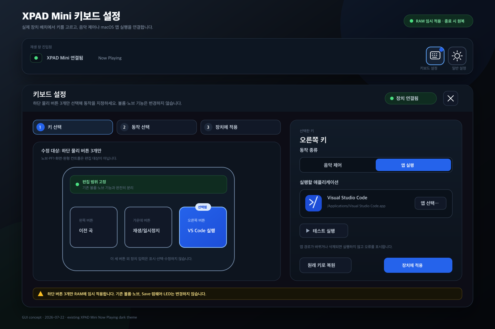
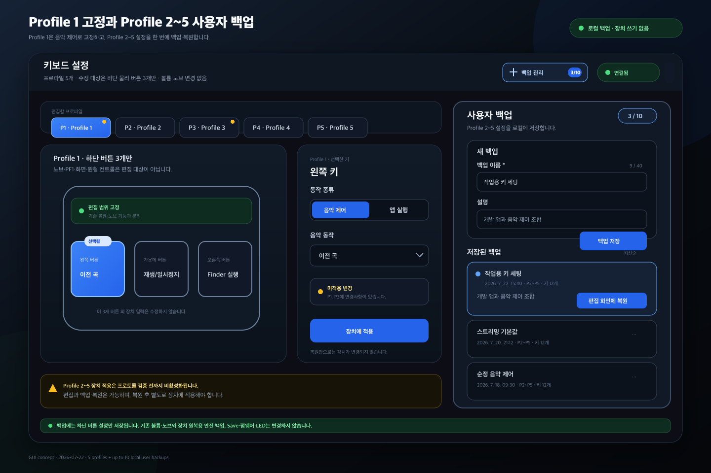

# XPAD Mini 키보드 설정·프로파일·백업 기능 계획

- 상태: P1 고정 음악 제어, P2~P5 실제 장치 읽기·로컬 설정·백업·단축 동작 구현 완료, XPAD 일반 키 HID 쓰기는 안전 게이트로 보류
- 작성일: 2026-07-22
- 대상: macOS용 `XPAD Mini Now Playing`
- 구현 범위: 단계 1~4와 dev UI 검증 완료. 단계 0·5의 일반 키 HID 적용은 프로토콜 근거와 안전 경계 승인 전까지 비활성화한다.
- 사용자 범위: Profile 1 하단 3버튼 고정 음악 제어, Profile 2~5 하단 물리 버튼 3개 편집, macOS 앱 실행, 이름·설명을 갖는 사용자 백업 최대 10개
- 제외 범위: 볼륨 조절, 노브 좌/우·클릭, 상단 `PF1`, 화면·원형 컨트롤과 기존 미세 볼륨 설정
- 차단 조건: P1~P5 조회와 원복은 확인됐다. 이 3개 버튼의 `KeyInfo` 쓰기 전체 rollback과 실패 경로가 실기기에서 확인되기 전에는 HID 쓰기 구현을 시작하지 않는다.



벡터 원본: [`keyboard-settings-gui.svg`](./keyboard-settings-gui.svg)



벡터 원본: [`keyboard-backup-profiles-gui.svg`](./keyboard-backup-profiles-gui.svg)

## 0. 구현 현황

| 항목 | 상태 | 구현·검증 근거 |
|---|---|---|
| 설정 아이콘 왼쪽 키보드 아이콘 | 완료 | `src/renderer/src/components/player-view.tsx`, `app-header.tsx` |
| 일반 설정과 분리된 단일 키보드 창 | 완료 | `src/main/index.ts`의 `openKeyboardSettingsWindow()`, dev UI에서 1,080×760 창 재사용 확인 |
| Profile 1 고정, Profile 2~5 × 하단 버튼 3개 편집 | 완료 | `types.ts` 정규화, `keyboard-settings-view.tsx`, main/renderer 테스트 |
| 지원 키 변경·macOS `.app` 실행 | 완료 | 일반/탐색/기능/미디어 키 allowlist, `music/playback-controls.ts`, `input/key-action-router.ts`, native 앱 선택 IPC |
| 이름·설명 사용자 백업 최대 10개 | 완료 | `keyboard-backups.ts`, 최대 수량·정확 복원·손상 파일 비파괴 테스트 |
| F16~F18 로컬 라우팅 | 완료 | 사용자가 활성화한 경우에만 등록하며 F19/F20은 등록·해제하지 않음 |
| 하단 3버튼의 XPAD HID 키맵 변경 | 보류 | P1은 쓰기 금지로 고정하고 P2~P5 실제 읽기는 완료. 일반 키 쓰기 전체 rollback 미검증으로 UI의 `장치에 적용`을 비활성화하고 이유 표시 |
| 볼륨·노브 비간섭 | 완료 | 키보드 전용 저장 IPC는 `fineVolume*`, `knobKeymapBackup`, 노브 장치 경로를 호출하지 않음 |

이하의 장치 `read/backup/apply/readback/rollback` 항목은 안전 게이트 통과 후 수행할 후속
계획이다. 현재 구현은 로컬 편집·백업·복원·앱 실행과 F16~F18 라우팅까지만 제공하며,
일반 키 `KeyInfo`나 Save/플래시 명령을 전송하지 않는다.

## 1. 목표 결과

재생 창의 기존 설정 아이콘 왼쪽에 `키보드 설정` 아이콘을 추가한다. 이 버튼은 일반 설정 창과 같은 방식의 독립 `BrowserWindow`를 열고, 이미 열려 있으면 새 창을 만들지 않고 기존 창을 포커스한다.

키보드 설정 창에서 사용자는 다음 작업을 쉽게 완료할 수 있어야 한다.

- `Profile 1`은 이전 곡·재생/일시정지·다음 곡의 보기 전용 고정 프로필로 유지한다.
- `Profile 2`부터 `Profile 5`까지 전환하며 각 프로파일의 하단 키 3개를 따로 설정한다.
- 각 키에 영문·숫자·기호·기본/탐색/기능 키, `이전 곡`·`재생/일시정지`·`다음 곡`, 또는 사용자가 선택한 macOS 애플리케이션 실행을 지정한다.
- 현재 Profile 2~5 설정을 이름과 설명을 입력해 사용자 백업으로 보관한다.
- 최대 10개 사용자 백업 중 하나를 선택해 당시의 Profile 2~5, 앱 경로, 활성 프로파일을 편집 화면에 그대로 불러온다. Profile 1은 복원 데이터와 무관하게 고정값을 유지한다.
- 복원 내용을 검토한 뒤 `로컬 설정 저장`으로 활성 프로파일과 F16~F18 라우팅을 갱신한다. XPAD 장치 적용은 안전 게이트가 열릴 때까지 비활성화한다.

장치가 준비되면 UI는 모든 프로필의 현재 하단 3키를 실제로 읽어 표시한다. 연결 실패 시 로컬 Q/W/E를 실제값처럼 대체 표시하지 않고 읽기 재시도 화면을 보여준다. 임의 매크로, 셸 명령, URL, 펌웨어/플래시 저장은 범위에서 제외한다.

**범위 불변조건:** 이 기능이 읽거나 쓰는 물리 입력은 사용자가 표시한 하단 버튼 3개뿐이다. 기존 볼륨 기능이 사용하는 노브 좌/우 엔트리, F19/F20 단축키, 미세 볼륨 설정·상태·로그·복원 흐름은 읽기·쓰기·재등록·초기화하지 않는다.

## 2. 확인한 근거

| 확인 내용 | 근거 | 계획에 미치는 영향 |
|---|---|---|
| 재생 창에는 설정 아이콘 버튼과 별도 설정 창 IPC가 있다. | `src/renderer/src/App.tsx`, `components/app-header.tsx`, `src/preload/index.ts`, `src/main/index.ts`의 창 역할·열기 IPC | 같은 아이콘 버튼/독립 창 패턴을 재사용했다. |
| renderer는 역할별 화면을 같은 엔트리에서 구분한다. | `src/renderer/src/App.tsx`의 `AppView`와 `windowView()` | `keyboard` 역할과 전용 BrowserWindow를 같은 방식으로 추가했다. |
| 설정 계약은 `AppConfig`와 `userData/config.json`에 저장되고 normalize된다. | `src/shared/types.ts`의 `AppConfig`, `src/main/config.ts`의 `loadConfig()`·`saveConfig()` | 키보드 설정과 사용자 백업을 버전 있는 별도 계약으로 정규화했다. |
| 기존 백업은 Profile 1 노브 좌우 원본 56바이트를 담는 볼륨 기능 내부 안전 백업이다. | `src/shared/types.ts`의 `KnobKeymapBackup`, `src/main/config.ts`의 `normalizeKnobKeymapBackup()`, `docs/PROTOCOL.md`의 `0x10 KeyInfo` 절 | 사용자 백업과 목적·저장소·UI를 분리하고 기존 노브 백업에는 접근하지 않는다. 기존 내부 백업은 10개 한도에 포함하지 않는다. |
| 공식 Web DRV UI에서 Profile 1~5 선택과 프로파일별 매핑이 확인됐다. | `docs/XPAD_MINI_DIRECT_API.md`의 프로파일·키 설정 절 | 장치에는 5개 프로파일이 있으나 제품 정책은 P1을 고정하고 P2~P5만 편집·백업한다. |
| 실기기 문서상 Profile 1 엔트리 0~2는 하단 자석축 키이며 출고 키코드는 Q/W/E였다. | `docs/PROTOCOL.md`의 `0x10 KeyInfo` 절 | Profile 1의 하단 3개는 근거가 있지만 다른 프로파일에 같은 인덱스를 추정 적용하지 않는다. |
| `0x02 SystemInfo`의 하위 `cfg_selection`으로 P1~P5를 RAM 전환하고 `0x10 KeyInfo`를 읽을 수 있다. | 공식 Bibimbap 패킷, 실기기 순회·원복 검증, `docs/PROTOCOL.md` | 실제 프로필 조회를 구현하되 일반 키 쓰기는 별도 rollback 게이트로 계속 차단한다. |
| 기존 볼륨 구현은 노브 좌우 엔트리 15/14와 F20/F19를 사용한다. | `src/main/device/protocol.ts`의 `KNOB_*` 상수와 노브 매핑/복원 구현 | 새 기능은 엔트리 14/15와 F19/F20을 허용 목록에 넣거나 트랜잭션에 포함하지 않는다. |
| 일반 키와 Save는 현재 명시적 금지 범위다. | `docs/PROTOCOL.md`의 `0x10 KeyInfo`와 현재 앱 최소 프로토콜 절 | 하단 버튼 3개의 프로토콜 안전 게이트가 구현 선행 조건이며 노브 범위는 변경하지 않는다. |
| Electron은 main process에서 native open dialog와 파일 기본 실행을 제공한다. | [dialog](https://www.electronjs.org/docs/latest/api/dialog), [shell.openPath](https://www.electronjs.org/docs/latest/api/shell) | 앱 선택·실행을 renderer에 노출하지 않고 main에서 처리한다. |

`https://bbb.pulsar.gg/sKey/`는 실제 브라우저에서 장치 연결 안내까지 확인했다. 장치 미연결 상태에서는 세부 키 편집 UI가 열리지 않아, 레이아웃은 사용자가 제공한 XPAD 도식 이미지를 참고했다. 공식 사이트의 세부 키 동작은 확인하지 못했으므로 그대로 복제했다고 주장하지 않는다.

## 3. UX 설계

### 3.1 진입점과 창 동작

- 재생 패널 우상단 도구 영역을 `키보드 설정`, `일반 설정` 순으로 배치한다.
- 키보드 아이콘 버튼의 접근 가능한 이름과 tooltip은 `키보드 설정 열기`로 한다.
- 버튼을 누르면 권장 1,080×760, 최소 900×680의 독립 창을 연다.
- 재생 창은 유지하고 키보드 설정 창은 하나만 존재하게 한다. 다시 누르면 기존 창을 복원·포커스한다.
- 키보드 설정 창을 닫아도 재생 창과 일반 설정 창은 닫히지 않는다.

### 3.2 고정 Profile 1과 Profile 2~5 탐색

- 상단에 `P1`~`P5` 탭과 현재 프로파일 이름(`Profile 1` 등)을 항상 표시한다.
- Profile 1 탭은 고정 음악 제어를 보기만 하며 편집 컨트롤을 표시하지 않는다. Profile 2~5 탭마다 하단 물리 버튼 3개의 설정 초안을 독립적으로 유지한다.
- 키보드 창 진입 때 장치에서 P2~P5 하단 키를 읽고, 탭을 누르면 해당 실기기 스냅샷을 표시한다. P1은 장치에서 읽지 않고 고정 음악 제어값을 표시한다. 탭 클릭 자체는 장치 프로필을 바꾸지 않는다.
- 선택한 프로파일과 키는 파란 테두리·배경, `선택됨` 텍스트를 함께 사용한다.
- 각 프로파일 탭에는 `변경됨` 점을 표시해 미적용 변경이 있는 프로파일을 빠르게 찾게 한다.
- XPAD Mini가 연결되고 LCD 프로토콜이 준비된 동안에만 Profile 2~5 로컬 편집·저장·백업·복원·테스트를 허용한다. 연결 실패 또는 프로토콜 미준비 상태에서는 전체 설정 컨트롤을 비활성화하고 사유를 표시한다.
- 연결 준비 상태에서는 P2~P5 실제값을 읽고 원래 프로필 복원 완료 후 표시한다. `장치에 적용`은 일반 키 쓰기 rollback 안전 게이트의 차단 사유를 보여준다.
- 장치 그림은 하단 버튼 3개만 편집 컨트롤로 표시한다. 노브·PF1·화면·원형 컨트롤은 설정 항목이나 포커스 대상으로 만들지 않는다.

### 3.3 쉬운 키 설정 흐름

1. 편집할 `P2`~`P5` 프로파일을 선택한다. `P1`은 고정값 확인만 가능하다.
2. 장치 그림에서 왼쪽·가운데·오른쪽 키를 선택한다.
3. `키 변경` 또는 `앱 실행`을 선택한다. `키 변경`의 그룹 목록에는 미디어 키도 포함한다.
4. 일반 키는 로컬 저장·백업하고, 미디어 키와 앱 실행은 `테스트 실행`으로 확인한다. `장치에 적용`은 안전 게이트 통과 전까지 비활성화한다.

`앱 실행`인 경우에만 `앱 선택…` 버튼과 앱 이름, 아이콘, 전체 경로, `테스트 실행`을 표시한다. 선택 취소는 기존 값을 보존한다. 적용 결과는 `role="status"`, 오류와 롤백 실패는 `role="alert"`로 알린다.

### 3.4 사용자 백업 흐름

키보드 설정 창 상단의 `백업 관리 n/10` 버튼으로 오른쪽 패널을 연다.

1. `새 백업`에서 필수 `백업 이름`(1~40자)과 선택 `설명`(0~500자)을 입력한다.
2. 저장 전 요약에서 `물리 버튼 3개 × Profile 2~5 = 논리 설정 12개`와 활성 프로파일을 확인한다.
3. `백업 저장`을 누르면 최신순 목록에 추가한다.
4. 목록에서 백업을 선택하면 이름·설명·생성 시각·Profile 2~5 요약을 확인한다.
5. `편집 화면에 복원`을 누르면 저장 당시 설정을 편집 초안으로 정확히 불러온다.
6. 사용자는 차이를 확인한 뒤 별도로 `장치에 적용`한다. 복원 자체는 HID 쓰기를 발생시키지 않는다.

10개가 차면 새 백업 버튼을 비활성화하고 `10/10 · 백업을 삭제하거나 기존 백업에 덮어쓰세요`를 표시한다. 사용자는 선택 백업 덮어쓰기 또는 삭제를 할 수 있으며 두 동작 모두 대상 이름과 영향을 보여주는 확인 대화상자를 거친다.

앱이 이동·삭제되어 저장 경로가 더는 존재하지 않더라도 복원 데이터는 변경하지 않는다. 해당 슬롯을 `앱을 찾을 수 없음`으로 표시하고, 앱을 다시 선택하기 전에는 그 슬롯의 장치 적용만 차단한다.

### 3.5 문구 원칙

- `저장` 대신 `장치에 적용`을 사용해 장치 플래시에 영구 기록한다는 오해를 막는다.
- `백업 저장`은 로컬 사용자 백업에만 사용한다.
- `편집 화면에 복원`은 복원 즉시 장치가 변경되지 않음을 명확히 한다.
- `원래 키로 복원`은 장치 원본 KeyInfo로 되돌리는 안전 동작에만 사용한다.
- 하단 고정 안내: `장치에는 RAM으로만 임시 적용되며 앱 종료 시 원래 키로 복원됩니다.`

## 4. 기능 계약

### 4.1 지원 단위와 기본값

| 단위 | 수량 | 기본값 |
|---|---:|---|
| 프로파일 | 5 | `Profile 1`~`Profile 5` |
| Profile 1 | 보기 전용 하단 물리 버튼 3개 | 이전 곡/재생·일시정지/다음 곡 |
| Profile 2~5 수정 대상 | 프로파일별 하단 물리 버튼 3개 | Q/W/E |
| 사용자 백업 | 최대 10 | 없음 |

F16~F18은 선택된 프로파일의 하단 버튼 3개 동작을 앱 내부로 라우팅하는 후보이다. 기존 볼륨 기능의 F19/F20 등록·해제 순서와 노브 엔트리 14/15에는 관여하지 않는다. 실제 적용 전 macOS와 대상 펌웨어에서 HID usage 및 `globalShortcut.register()` 성공을 검증하고, 충돌 또는 등록 실패 시 세 버튼 키맵을 적용하지 않는다.

### 4.2 제안 공유 타입

```ts
export type ProfileId = 1 | 2 | 3 | 4 | 5;
export type KeyboardSlot = 'left' | 'center' | 'right';
export type KeyboardKeyCode = /* src/shared/types.ts의 고정 allowlist */ string;

export type KeyboardAction =
  | { type: 'key'; keyCode: KeyboardKeyCode }
  | { type: 'launch-app'; appName: string; appPath: string };

export interface KeyboardProfileSettings {
  id: ProfileId;
  assignments: Record<KeyboardSlot, KeyboardAction>;
}

export interface KeyboardSettings {
  enabled: boolean;
  activeProfileId: ProfileId;
  profiles: Record<ProfileId, KeyboardProfileSettings>;
}

export interface KeyboardSettingsBackup {
  schemaVersion: 1;
  id: string;
  name: string;
  description: string;
  createdAt: string;
  activeProfileId: ProfileId;
  profiles: Record<ProfileId, KeyboardProfileSettings>;
}
```

`normalize()`는 프로파일 `1..5`, 세 슬롯, action discriminator, 키 코드 allowlist, 이름·설명 길이, `.app` 절대경로 형식을 검증한다. 어떤 입력이나 기존 백업이 들어와도 Profile 1은 고정 음악 제어값으로 덮어쓰고 Profile 2~5만 사용자 값을 보존한다. 1차 배포판의 `media` action은 같은 미디어 키의 `key` action으로 승계한다. 사용자 백업의 `profiles`는 현재 설정과 참조를 공유하지 않는 깊은 복사본이어야 한다.

### 4.3 두 백업의 분리

| 구분 | 사용자 백업 | 장치 안전 백업 |
|---|---|---|
| 목적 | 사용자가 만든 키 설정 스냅샷을 다시 사용 | 실패·종료 시 실제 KeyInfo 원본 복원 |
| 내용 | Profile 2~5 하단 버튼 12개의 논리 설정, 앱 경로, 활성 프로파일, 이름·설명. v1 호환 P1 필드는 고정값 | 새 기능이 수정한 하단 버튼의 원본 56바이트 KeyInfo만 포함 |
| UI | 생성·목록·덮어쓰기·삭제·복원 | 표시하거나 편집하지 않음 |
| 한도 | 최대 10개 | 연결 장치와 허용 엔트리에 필요한 수량 |
| 저장소 제안 | `userData/keyboard-backups.json` | 기존 노브 안전 백업과 분리한 키보드 전용 내부 복구 저장소 |
| 복원 효과 | 편집 초안만 교체, 장치 쓰기 없음 | 롤백·비활성화·정상 종료 때만 장치에 씀 |

`keyboard-backups.json`은 `schemaVersion`과 최대 10개 배열을 갖고, 임시 파일 작성 후 rename하는 원자적 교체 방식으로 저장한다. 손상된 항목은 전체 파일을 추측 복구하지 않고 유효 항목만 읽으며 오류를 사용자에게 알린다. 원본 KeyInfo 바이트와 볼륨·노브 설정은 사용자 백업에 포함하지 않는다.

### 4.4 정확 복원 계약

`편집 화면에 복원`은 선택한 백업의 다음 값을 그대로 불러온다.

- 활성 프로파일 ID
- Profile 2~5 각각의 왼쪽·가운데·오른쪽 동작
- Profile 1은 백업 내용과 관계없이 고정 음악 제어값
- 미디어 명령 종류
- 앱 이름과 절대경로
- 백업 이름·설명은 설정으로 복원하지 않고 백업 메타데이터로 유지

복원 전 현재 미적용 변경이 있으면 폐기 여부를 확인한다. 복원 후에는 모든 프로파일을 `변경됨`으로 표시하고, 장치에는 아무 패킷도 보내지 않는다. 사용자가 `장치에 적용`한 뒤 readback이 성공해야 적용 완료로 간주한다.

### 4.5 IPC 경계

| IPC | 방향 | 역할 |
|---|---|---|
| `open-keyboard-settings-window` | renderer → main | 전용 창 생성/복원/포커스 |
| `close-keyboard-settings-window` | renderer → main | 요청한 키보드 창만 닫기 |
| `pick-application` | renderer → main | native dialog로 `.app` 1개 선택 후 이름·경로·아이콘 반환 |
| `test-launch-application` | renderer → main | 현재 선택 앱을 사용자 요청으로 한 번 실행 |
| `list-keyboard-backups` | renderer → main | 정규화된 사용자 백업 목록 반환 |
| `create-keyboard-backup` | renderer → main | 10개 한도와 입력을 검증해 새 스냅샷 저장 |
| `overwrite-keyboard-backup` | renderer → main | 확인된 ID의 스냅샷·메타데이터 교체 |
| `delete-keyboard-backup` | renderer → main | 확인된 ID의 백업 삭제 |
| `load-keyboard-backup` | renderer → main | 선택 백업의 깊은 복사본 반환, HID 쓰기 없음 |
| 기존 `get-config` / `set-config` | 양방향 | 키 설정 조회·검증·적용 |

IPC 입력은 renderer를 신뢰하지 않는다. `BrowserWindow.fromWebContents()`로 호출 창을 확인하고, ID·문자열 길이·백업 개수·앱 경로를 main에서 다시 검증한다.

### 4.6 앱 선택·실행과 키 변경

- 앱 선택은 native open dialog로 `.app` 하나만 허용한다.
- `app.getFileIcon()`으로 32px 아이콘을 얻고, 실행은 `shell.openPath(appPath)`만 사용한다.
- `exec`, 셸 문자열, 사용자 인자, URL scheme, AppleScript 문자열 삽입은 사용하지 않는다.
- 일반/탐색/기능/미디어 키는 고정 allowlist만 저장한다. 실기기 읽기값 표시를 위해 F16~F18을 포함하고 기존 볼륨의 F19/F20은 선택 목록에서 제외한다.
- 미디어 키 `MediaTrackPrevious`, `MediaPlayPause`, `MediaTrackNext`만 현재 로컬 테스트와 F16~F18 실행을 지원한다. 일반 키는 안전한 장치 적용이 확인되기 전까지 로컬 저장·백업만 제공한다.
- 실행 후 monitor refresh를 요청해 LCD와 UI 상태를 빠르게 동기화한다.

## 5. 프로토콜 안전 게이트

현재 프로젝트 지침은 노브 좌우 이외 키를 쓰지 말라고 명시한다. P1~P5 주소 지정과 읽기·원복은 확인됐지만 다음 쓰기 조건을 모두 충족하고 안전 경계 변경이 승인되기 전에는 일반 키 HID 쓰기를 시작하지 않는다.

1. Profile 1~5를 SystemInfo RAM 전환으로 순회하고 조회 전 프로필로 복원하는 방식을 패킷 캡처와 실기기로 확인한다. **완료**
2. 각 프로파일의 하단 세 키가 `KeyInfo` 엔트리 `0~2`인지 실제 응답으로 확인한다. **완료**
3. 확인된 `하단 물리 버튼 3개 × Profile 2~5` 논리 엔트리 12개의 원본 56바이트를 모두 확보·검증한 경우에만 첫 쓰기를 허용한다. Profile 1 쓰기는 허용하지 않는다.
4. Profile 2~5와 하단 버튼 세 엔트리만 타입과 런타임 양쪽에서 화이트리스트한다. Profile 1과 기존 노브 14/15를 포함한 그 밖의 엔트리 접근은 거부한다.
5. main의 단축키 등록이 모두 성공한 뒤 프로파일별 장치 쓰기를 시작한다.
6. 메타데이터와 출력 action 외 바이트를 보존하고 각 쓰기 직후 전체 허용 필드를 readback으로 검증한다.
7. 키 하나, 프로파일 하나, 전체 적용의 세 경계에서 실패 시 역순 롤백하고 복구 결과를 상태에 포함한다.
8. 설정 비활성화, 정상 종료, 단축키 등록 실패 때 새 기능이 수정한 하단 버튼만 원복한다. 기존 노브 원복 상태와 순서를 변경하지 않는다.
9. `0x0D Save`, MemoryWrite, LED, 부트로더, 키보드 HID 컬렉션은 계속 구현하지 않는다. Profile 2~5 적용이 Save를 요구한다면 RAM-only 정책상 해당 장치 적용은 지원하지 않는다.
10. 변경된 안전 경계와 실기기 결과를 `docs/PROTOCOL.md`, `docs/XPAD_MINI_DIRECT_API.md`, `docs/DEVELOPMENT_REPORT.md`에 함께 기록한다.

이 게이트와 무관하게 Profile 2~5의 로컬 편집·사용자 백업·편집 화면 복원은 구현하고 검증할 수 있다. Profile 1은 고정하며 장치에 쓰는 버튼만 근거가 확보된 범위로 제한한다.

## 6. 구현 단계

### 단계 0 — 프로파일 프로토콜 조사와 안전 경계 결정 (읽기 완료, 쓰기 보류)

- Profile 1~5의 선택/주소 지정, 키 엔트리, RAM 유지 범위를 읽기 우선으로 확인한다.
- Save 없이 프로파일별 RAM 임시 적용이 가능한지 검증한다.
- 완료 기준: Profile 2~5 하단 물리 버튼의 논리 엔트리 12개에 대한 근거와 rollback 절차가 문서화되고, P1 고정·노브 비간섭 경계가 승인됨.

### 단계 1 — 데이터·백업 계약과 회귀 테스트 (완료)

- `KeyboardSettings`, `KeyboardSettingsBackup`, v1 migration/normalize 테스트를 추가한다.
- 최대 10개, 이름·설명 경계, 깊은 복사, 손상 파일, 정확 복원을 순수 로직 테스트로 고정한다.
- 기존 노브 안전 백업, 새 하단 버튼 안전 백업, 사용자 백업의 저장소·API가 섞이지 않는지 검증한다.
- 완료 기준: 백업 생성→설정 변경→복원 시 Profile 2~5가 원본 스냅샷과 deep-equal이고 Profile 1은 고정값과 일치함.

### 단계 2 — 독립 창·5프로파일 GUI·앱 선택 (완료)

- 재생 창에 키보드 아이콘을 추가하고 독립 `keyboard` 창을 생성·재사용한다.
- `ProfileSelector`, `DeviceKeyMap`, `KeyActionEditor`, `ApplicationPicker`를 구현한다.
- `XPAD_DISABLE_HID=1`에서도 P1 고정 표시와 P2~P5 편집·앱 선택을 검증할 수 있게 한다.
- 완료 기준: `./build.sh dev-ui`에서 창 하나만 열림, P1 고정과 P2~P5 편집 유지, 앱 선택 상태를 확인함.

### 단계 3 — 사용자 백업 관리자 (완료)

- `BackupManager`, `BackupEditor`, `RestorePreview`와 백업 IPC를 구현한다.
- 생성·최신순 목록·덮어쓰기·삭제·복원·10개 한도·미존재 앱 상태를 구현한다.
- 완료 기준: 10개 저장 후 11번째가 거부되고, 임의 백업 복원 시 Profile 2~5의 논리 설정 12개와 활성 프로파일이 정확히 일치하며 Profile 1은 고정값을 유지함.

### 단계 4 — main action router (완료)

- 프로파일별 동작 해석, F16~F18 단축키 등록, 키 변경과 앱 실행을 분리한다.
- 등록 충돌, 앱 삭제/이동, 실행 오류를 상태로 전파한다.
- 완료 기준: 가짜 action executor로 다섯 프로파일의 각 동작과 오류를 검증함.

### 단계 5 — 승인된 장치 worker/프로토콜 확장 (안전 게이트로 차단)

- 안전 게이트를 통과한 범위에서만 하단 물리 버튼 3개의 프로파일별 논리 매핑을 read/backup/apply/readback/rollback/restore한다.
- LCD 전송을 키맵 트랜잭션 동안 중지하고 완료 후 재개한다.
- 기존 볼륨 모듈의 엔트리 14/15, F19/F20, 설정·상태·로그는 변경하지 않는다.
- 키보드 기능 내부에서는 `하단 버튼 원복 → F16~F18 해제` 순서를 지키고, 기존 앱 전체 종료 순서를 보존한다.
- 완료 기준: fake HID와 실기기에서 부분 실패 롤백, 프로파일 전환, 정상 종료 원복, 기존 미세 볼륨 회귀 없음이 검증됨.

### 단계 6 — 통합·실기기 검증과 문서화 (로컬 범위 완료, HID 범위 보류)

- `./build.sh check`
- `npm test -- --run` — 7개 파일 38개 테스트에서 P1 고정, P2~P5 고유값 로드·원래 프로필 복원, 미지원 코드 비노출, KeyInfo 해석, 연결 실패 잠금을 포함해 검증
- `./build.sh dev-ui`의 5프로파일·백업·접근성·장치 미연결 잠금 수동 검증
- 승인 후 `./build.sh stop`과 `./build.sh debug-hid`를 이용한 실기기 검증
- Mac 아키텍처, XPAD 펌웨어, 각 프로파일의 readback/원복 결과 기록
- 완료 기준: 자동 검증 통과, 사용자 백업 deep-equal 증거, 실기기 원복 증거, 프로토콜 문서 동시 갱신.

## 7. 예상 변경 파일

| 영역 | 파일 |
|---|---|
| 계약/설정 | `src/shared/types.ts`, `src/main/config.ts`, 신규 `src/main/keyboard-backups.ts` |
| 창/IPC/실행 | `src/main/index.ts`, `src/preload/index.ts`, `src/renderer/src/env.d.ts` |
| 음악 동작 | 신규 `src/main/music/playback-controls.ts` |
| 단축키 라우터 | 신규 `src/main/input/key-action-router.ts` |
| 장치 프로토콜 | 이번 변경 없음. 안전 게이트 승인 뒤 `protocol.ts`, `device-host.ts`, `device-worker.ts` 검토 |
| renderer | `App.tsx`, `app-header.tsx`, 신규 keyboard/profile/backup 컴포넌트, `styles.css` |
| 테스트 | config/backup/action/protocol 인접 `*.test.ts` 또는 `*.test.tsx` |
| 문서 | `DESIGN.md`, `docs/PROTOCOL.md`, `docs/XPAD_MINI_DIRECT_API.md`, `docs/DEVELOPMENT_REPORT.md` |

## 8. 수용 기준

- 키보드 아이콘이 설정 아이콘 바로 왼쪽에 있고 mouse/keyboard/VoiceOver로 구분 가능하다.
- 재생 창을 유지한 채 일반 설정과 동일한 생명주기의 키보드 설정 창이 한 개만 열린다.
- P1은 이전 곡·재생/일시정지·다음 곡으로 표시되고 편집할 수 없다.
- P2~P5 각각 세 키의 편집 내용이 프로파일 전환 후에도 유지된다.
- P2~P5에 서로 다른 값을 저장한 뒤 각 탭을 순서대로 누르면 해당 프로파일 값만 표시되고 F16~F18 사용 프로파일은 바뀌지 않는다.
- USB 연결 실패 또는 LCD 프로토콜 미준비 시 키보드와 일반 설정의 변경·저장·백업·복원·테스트 컨트롤이 비활성화되며 main IPC도 변경 요청을 거부한다.
- 사용자는 이름 1~40자와 설명 0~500자를 입력해 최대 10개 백업을 저장할 수 있다.
- 10개 상태에서 11번째 생성은 파일을 변경하지 않고 거부되며 삭제 또는 덮어쓰기 경로가 제공된다.
- 백업 복원 후 활성 프로파일, Profile 2~5 하단 물리 버튼의 논리 동작 12개, 앱 이름·경로가 저장 당시 값과 정확히 일치하고 Profile 1은 고정값을 유지한다.
- 해석하지 못한 장치 동작은 오류 코드 없이 한 줄 `미지원`으로 표시한다.
- 복원은 편집 초안만 바꾸고 사용자가 `장치에 적용`하기 전에는 HID 쓰기를 하지 않는다.
- 이동·삭제된 앱 경로도 보존하되 오류를 표시하고 재선택 전 해당 슬롯의 적용을 차단한다.
- 어떤 실패에서도 Save/플래시 명령이 호출되지 않는다.
- 부분 적용 실패는 원복되며 비활성화와 정상 종료 때 모든 변경 키가 원래 동작으로 복구된다.
- 볼륨 조절, 노브 좌/우·클릭, F19/F20, `fineVolume*`, 노브 안전 백업과 관련된 값·IPC·로그·장치 엔트리는 새 기능의 생성·적용·백업·복원 전후에 변하지 않는다.
- 자동 테스트, `./build.sh check`, dev UI 검증, 승인된 실기기 검증 결과가 기록된다.

## 9. 확인이 필요한 구현 차단 사항

- **읽기 완료:** Profile 1~5의 선택/주소 지정과 각 하단 키 엔트리 0~2를 실기기에서 확인하고 원복을 구현했다.
- **구현 차단:** 일반 키 및 확인된 프로파일 엔트리의 RAM-only 임시 쓰기를 프로젝트 안전 경계에 추가할지 승인해야 한다.
- **정책 유지:** 공식 영구 저장에 Save가 필요하면 이 앱에서는 지원하지 않고 로컬 백업과 앱 실행 중 RAM 적용만 제공한다.
- **제외 확정:** 볼륨 조절, 노브 좌/우·클릭, 상단 `PF1`, 화면·원형 컨트롤은 이번 기능과 후속 구현 단계에 포함하지 않는다.
- **후속 범위:** 임의 키 조합과 사용자 지정 프로파일 이름은 이번 1차 범위에 포함하지 않는다.
