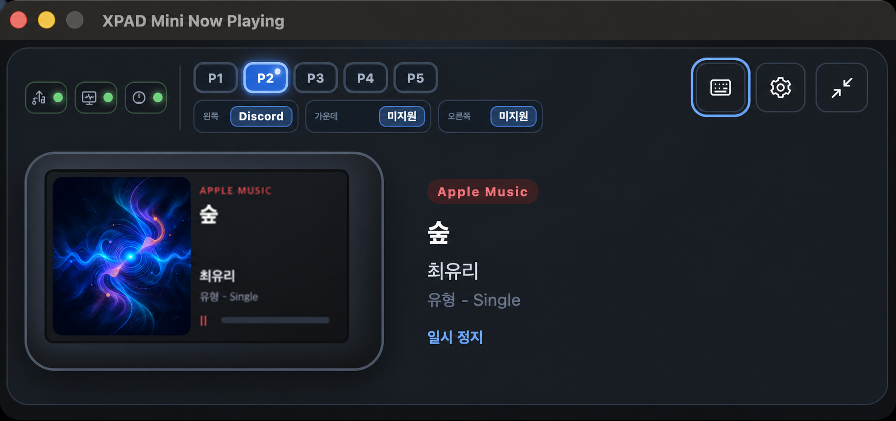
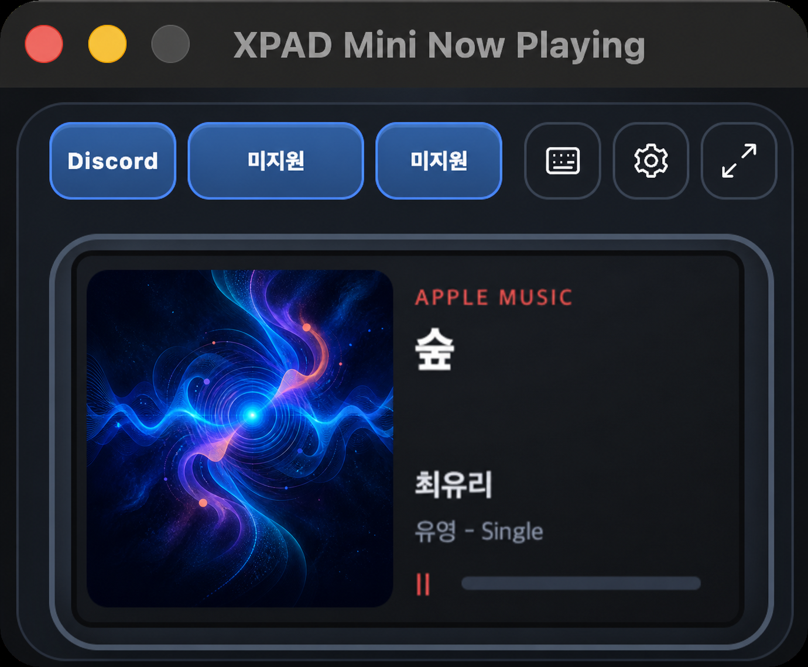
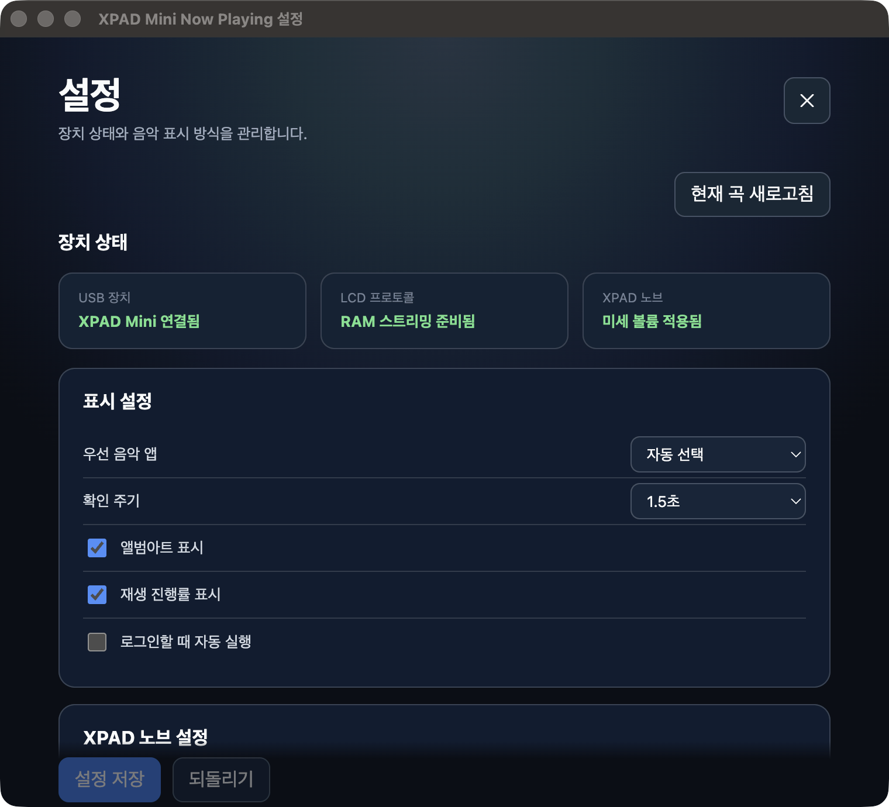
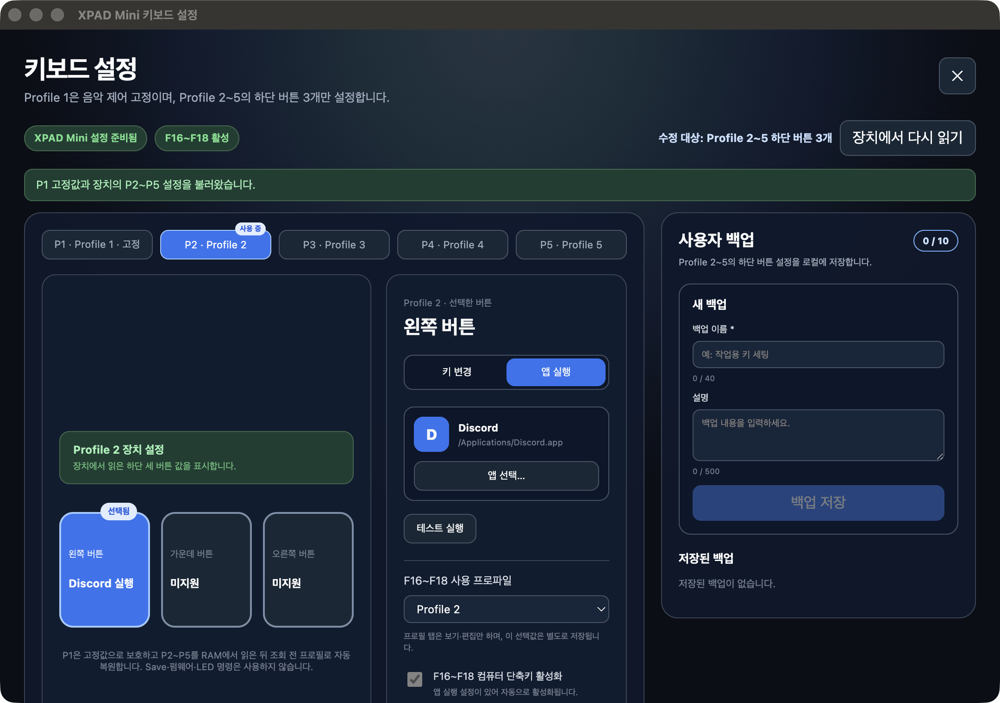
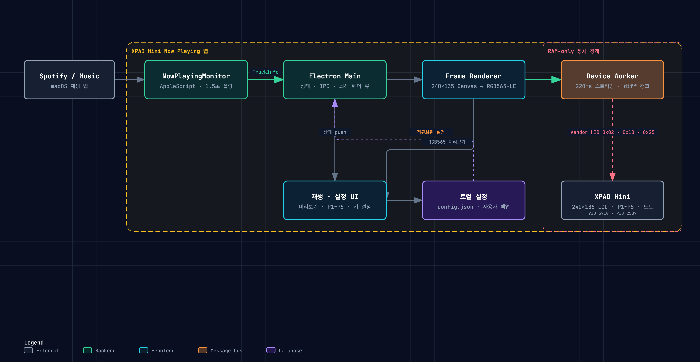
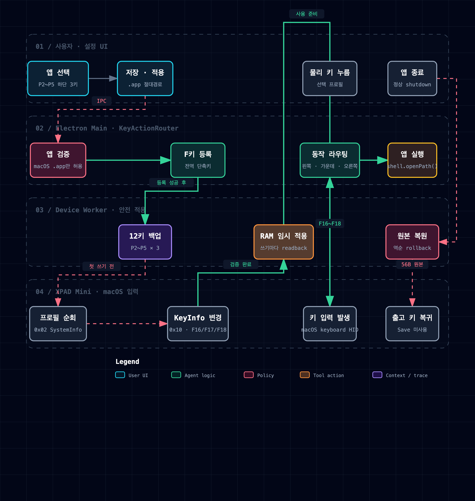

# XPAD Mini Now Playing

> ⚠️ **필수 기기 — [Pulsar Lab XPAD Mini](https://www.pulsar.gg/products/pulsar-lab-xpad-mini-gaming-key-pad) 실기기가 반드시 필요합니다.**
>
> 실제 LCD 출력, P1~P5 프로필 전환, 물리 키와 노브 기능은 기기를 USB로
> 연결해야 사용할 수 있습니다. VID `0x3710` / PID `0x2507`과 240×135 LCD에
> 맞춘 전용 앱이므로 다른 키보드·매크로패드·XPAD 모델은 지원하지 않습니다.
> 장치가 없으면 `./build.sh dev-ui`로 설정 UI와 음악 조회만 확인할 수 있습니다.

**소스 코드·다운로드**

- GitHub 저장소:
  [https://github.com/zime78/XPAD-mini-Led](https://github.com/zime78/XPAD-mini-Led)
- 소스 ZIP:
  [`main` 최신 소스 다운로드](https://github.com/zime78/XPAD-mini-Led/archive/refs/heads/main.zip)

  

**제품 정보·구매처**

- 글로벌: [공식 제품 페이지](https://www.pulsar.gg/products/pulsar-lab-xpad-mini-gaming-key-pad) ·
  [미국 공식몰](https://us.pulsar.gg/products/pulsar-lab-xpad-mini-gaming-key-pad)
- 국내: [Pulsar 공식 사이트](https://pulsargg.kr/) ·
  [Pulsar 공식파트너몰](https://pulsar-mall.co.kr/)

> 판매 여부와 가격은 지역 및 판매처에 따라 달라질 수 있으므로 각 판매 페이지에서
> 확인하십시오. 제품 이미지는 제조사 공식 스토어 CDN을 참조하며 저작권은
> Pulsar Gaming Gears에 있습니다.

macOS의 Spotify와 Apple Music 재생 정보를 Pulsar Lab XPAD Mini의 240×135 LCD에
표시하는 Electron 트레이 앱입니다. 곡 정보와 앨범아트뿐 아니라 P1~P5 프로필,
하단 3키의 앱 실행, XPAD 노브 미세 볼륨까지 하나의 화면에서 관리합니다.

## 한눈에 보기

| 항목 | 내용 |
| --- | --- |
| 현재 버전 | `1.0.0` |
| 대상 운영체제 | macOS |
| 대상 장치 | Pulsar Lab XPAD Mini 전용, VID `0x3710` / PID `0x2507` |
| 음악 서비스 | Spotify, Apple Music |
| LCD | 240×135, RGB565 little-endian |
| 구현 형태 | Electron + React + Node worker thread + `node-hid` |
| 소스 코드 | [zime78/XPAD-mini-Led](https://github.com/zime78/XPAD-mini-Led) |

## 처음 보는 분을 위한 사용 흐름

| 1. 기기 연결 | 2. 음악 재생 | 3. 화면 확인과 설정 |
| --- | --- | --- |
| XPAD Mini를 Mac에 USB로 연결하고 입력 모니터링 권한을 허용합니다. | Spotify 또는 Apple Music에서 음악을 재생합니다. | 앱이 곡 정보를 읽어 미리보기와 LCD를 갱신합니다. 필요하면 P2~P5 키와 노브를 설정합니다. |

기획자는 “음악 재생 정보가 앱 화면과 기기 LCD에 함께 표시되고, 프로필별 물리 키가
음악 제어 또는 앱 실행으로 이어진다”는 사용자 흐름을 먼저 보면 됩니다. 초급
개발자는 아래 화면 캡처와 구조도에서 UI, Electron main, device worker, XPAD Mini의
경계를 순서대로 확인할 수 있습니다.

## 현재 구현된 기능

- 실행 중인 Spotify와 Apple Music을 감지해 곡명, 아티스트, 앨범, 재생 상태,
  진행률과 앨범아트를 읽습니다.
- 같은 240×135 프레임을 앱 미리보기와 실제 XPAD Mini LCD에 표시합니다.
- 픽셀 폭 기반 줄바꿈, 한글·emoji grapheme 처리, RGB565 ordered dithering으로
  작은 LCD에서의 텍스트와 색 표현을 개선했습니다.
- 확장뷰와 미니뷰를 전환할 수 있으며, 일반 설정과 키보드 설정은 별도 창으로
  분리했습니다.
- P1은 이전 곡·재생/일시정지·다음 곡으로 고정하고, P2~P5의 하단 3키에는
  macOS 앱 실행 동작을 연결할 수 있습니다.
- XPAD 노브 한 칸을 macOS의 실제 다음 출력 단계에 맞추고, 조절 결과를 LCD와
  앱 미리보기에 잠시 표시합니다.
- USB 분리 후 3초 간격 재연결, 로그인 시 실행, 키 설정 사용자 백업을 지원합니다.
- Profile 5는 로그인된 YouTube를 재생한다. 소리는 공식 watch 창, LCD·미리보기는
  같은 세션의 음소거 창에서 뽑은 240×135 RGB565다. 캡처는 HID 전송보다 조금
  빠르고, 기기로는 최신 1장만 보낸다. 미리보기 베젤에는 직전 전송 간격을 표시한다.

## 화면

### 확장뷰와 미니뷰

| 확장뷰 | 미니뷰 |
| --- | --- |
| 음악 정보, 장치 상태, P1~P5와 현재 키 동작을 함께 표시합니다. | 실제 LCD 비율을 유지하면서 자주 쓰는 동작만 작은 창에 배치합니다. |
|  |  |

문서용 재생 화면에는 실제 아티스트의 앨범아트 대신 AI로 생성한 가상 샘플 이미지를
사용했습니다.

### 일반 설정

우선 음악 앱, 확인 주기, 앨범아트·진행률 표시, 로그인 시 자동 실행, XPAD 노브
미세 볼륨을 설정합니다. USB 연결, LCD 프로토콜, 노브 적용 상태도 같은 화면에서
확인할 수 있습니다.

### 키보드 설정

P1은 음악 제어로 고정되고, P2~P5의 하단 3키에는 macOS 앱 실행 동작을 연결할 수
있습니다. 화면 왼쪽에서 프로필과 물리 버튼을 고르고, 가운데에서 실행할 앱을
선택하며, 오른쪽에서 설정 백업을 관리합니다. “장치에서 다시 읽기”는 현재 기기
상태를 UI에 다시 반영합니다.

## 동작 구조

처음에는 그림을 왼쪽에서 오른쪽으로 읽으면 됩니다. Spotify·Music이 입력,
XPAD Mini LCD가 최종 출력이며, 점선으로 표시된 오른쪽 영역만 실제 기기와
통신합니다.

1. `NowPlayingMonitor`가 Spotify와 Music을 확인하고 AppleScript로 현재 재생 정보를
   읽습니다.
2. Electron main 프로세스는 최신 상태만 렌더 큐에 남기고 설정 UI와 device worker에
   전달합니다.
3. 240×135 Canvas 렌더러가 프레임을 만든 뒤 LCD용 RGB565 little-endian 데이터로
   변환합니다.
4. device worker는 직전 프레임과 달라진 청크만 Vendor HID로 전송하고, 유지 전송과
   keep-alive로 펌웨어 기본 화면이 다시 나타나지 않게 합니다.
5. 장치가 분리되면 HID 계층이 재연결을 시도하고, 준비가 끝나면 최신 화면과 설정을
   다시 적용합니다.

## 앱 실행 키가 동작하는 순서

1. 사용자가 P2~P5의 왼쪽·가운데·오른쪽 버튼 중 하나에 실행할 macOS 앱을
   선택합니다.
2. 앱은 장치의 기존 키 설정을 먼저 백업합니다.
3. 선택한 슬롯만 F16~F18에 RAM 임시 매핑하고, 쓰기 직후 다시 읽어 성공 여부를
   확인합니다.
4. 물리 키를 누르면 현재 프로필과 버튼 위치에 연결된 앱이 실행됩니다.
5. 기능을 끄거나 앱이 정상 종료되면 백업한 원본 키 설정으로 복원합니다.

기획자는 이 그림에서 “설정 → 물리 키 사용 → 종료 시 원복”이라는 제품 흐름을,
개발자는 UI·Electron main·device worker·macOS 입력 사이의 책임 분리를 확인할 수
있습니다.

## 장치 안전 경계

장치 쓰기는 RAM에서만 수행합니다.

- 허용 명령은 `0x02` ScreenInfo/SystemInfo, `0x10` KeyInfo,
  `0x25` Display뿐입니다.
- 프로필 전환과 앱 실행용 키 매핑은 쓰기 뒤 readback으로 확인합니다.
- 앱 실행 키와 노브의 원본 56바이트 값을 백업하고, 기능 비활성화나 정상 종료 때
  복원합니다.
- Save, MemoryWrite, LED, 펌웨어, 부트로더 명령은 앱 실행 경로에 없습니다.
- 케이블을 분리하면 장치는 자체 화면으로 돌아갑니다.

저수준 프로토콜은 실기기 관찰과 공개 Sayo 호환 구현을 대조한 비공식 역공학
결과입니다. 제조사가 공개한 네이티브 SDK를 사용한 구현은 아닙니다.

## 현재 검증 상태

2026-07-28에 `main` 기준으로 다시 확인했습니다.

| 검증 | 결과 |
| --- | --- |
| 자동 테스트 | Vitest 11개 파일, 57개 테스트 통과 |
| 타입 검사·프로덕션 빌드 | `./build.sh check` 통과 |
| 프로덕션 의존성 감사 | `npm audit --omit=dev` 취약점 0건 |
| 공개 저장소 비밀정보 검사 | Git 파일·이력·Actions 로그, GitHub Secret Scanning, Gitleaks 8.30.1 탐지 0건 |

실기기 USB 연결, LCD 화면 갱신, P1~P5 RAM 프로필 전환, 앱 실행 키와 노브 원복은
프로젝트 개발 기록의 수동 검증 결과를 함께 사용합니다. 자동화된 실기기 통합 테스트는
아직 없습니다.

## 현재 제한사항

- XPAD Mini 전용이며 다른 키보드나 매크로패드는 지원하지 않습니다.
- 음악 조회와 앨범아트 추출이 AppleScript 기반이어서 macOS에서만 동작합니다.
- Apple notarization은 아직 완료하지 않았습니다.
- P2~P5의 일반 키 설정은 조회·로컬 백업까지만 지원합니다. 안전한 전체 rollback이
  준비되지 않은 일반 키 장치 쓰기는 UI에서 차단합니다.
- Spotify 앨범아트 네트워크 요청이나 Apple Music artwork 추출이 실패하면 텍스트
  중심 화면으로 표시합니다.

## 소스와 라이선스

소스 코드는 [GitHub 공개 저장소](https://github.com/zime78/XPAD-mini-Led)에서
확인할 수 있습니다. 이 프로젝트는 MIT 라이선스의
[`SpinnerMaster/xpad-mini-claude-code`](https://github.com/SpinnerMaster/xpad-mini-claude-code)
HID 프로토콜 구현을 기반으로 음악 표시 앱으로 확장했습니다.

Pulsar Lab, Spotify, Apple과 제휴하거나 공식 승인을 받은 프로젝트가 아닙니다.
