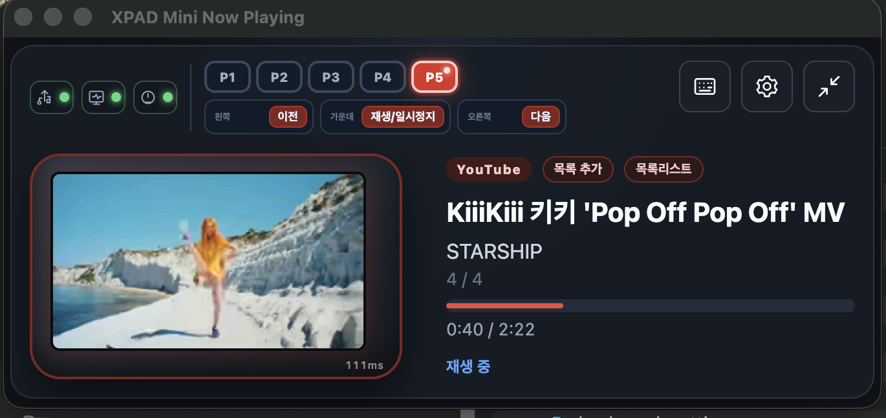
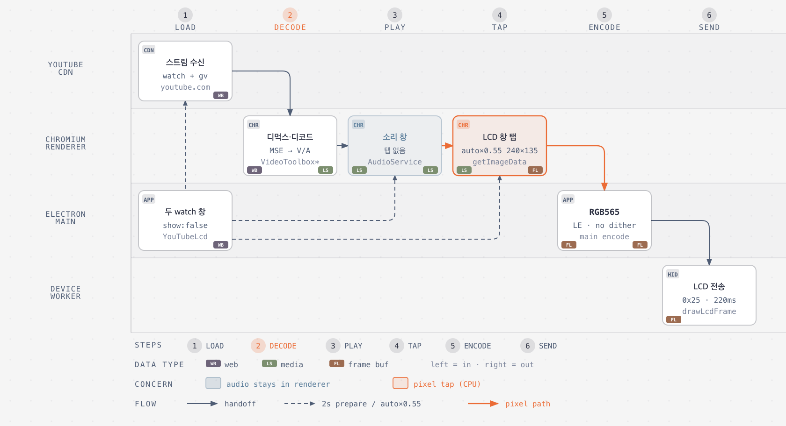

# XPAD Mini Now Playing — YouTube 재생

이 글은 **처음 쓰는 분**을 위한 YouTube(P5) 안내입니다. 앱이 무엇을 보여 주는지, 버튼을 어떻게 쓰는지, 그리고 **왜 창을 둘로 나눴는지**를 순서대로 적었습니다.

한 줄로 말하면, Mac에서 로그인한 공식 YouTube를 재생하고 그 **작은 화면만** XPAD Mini LCD에 보내는 기능입니다. 휴대폰 영상을 내려받아 패드에 넣는 방식이 아닙니다.

소스: [zime78/XPAD-mini-Led](https://github.com/zime78/XPAD-mini-Led)



위 화면에서 왼쪽은 기기에 나가는 미리보기, 오른쪽은 지금 곡 정보입니다. YouTube 뱃지 옆에 **목록 추가**와 **목록리스트**가 있고, 미리보기 오른쪽 아래 `111ms` 같은 숫자는 **직전에 기기로 한 장을 보낸 간격**입니다. 소리가 그만큼 늦게 들린다는 뜻이 아닙니다.

## 처음 보면 헷갈리는 말

| 말 | 쉬운 뜻 |
| --- | --- |
| P5 | 앱과 기기에서 다섯 번째 프로필. YouTube 전용입니다 |
| watch | 브라우저에서 보는 그 YouTube 영상 페이지 |
| 소리 창 / LCD 창 | 앱이 숨겨 둔 YouTube 창 두 개. 하나는 스피커, 하나는 화면 캡처 |
| tiny | YouTube가 주는 가장 낮은 화질(144p). LCD가 240×135라서 이것으로 충분합니다 |
| RGB565 | 기기가 받을 수 있는 그림 형식. 가로 240, 세로 135, 픽셀당 2바이트 |
| HID | USB로 키보드·화면에 명령을 보내는 통로. 이 앱은 화면용 통로만 엽니다 |
| persist 세션 | 앱 안에만 있는 YouTube 로그인. Mac의 Chrome 로그인과 따로입니다 |

## 쓰는 방법

준비물: macOS, USB로 연결된 XPAD Mini, 앱이 연 창에서 로그인한 YouTube. 광고를 건너뛰려면 그 계정에 Premium이 있어야 합니다.

1. 기기를 꽂고 앱을 켭니다. 왼쪽 위 점 세 개가 초록이면 USB·화면·노브가 연결된 것입니다.
2. **P5**를 누릅니다. 하단 세 키가 이전 / 재생·일시정지 / 다음으로 바뀝니다.
3. 오른쪽 위 톱니바퀴(설정)에서 **YouTube 계정 연결**을 누릅니다.  
   Safari나 Chrome에 이미 로그인돼 있어도 이 앱과는 공유되지 않습니다. 앱이 띄운 창에서 한 번 더 로그인해야 합니다.
4. 재생 창 **목록 추가**에 영상 주소를 붙여 넣습니다.  
   `youtube.com/watch?v=…` 또는 `youtu.be/…` 또는 영상 ID 11자면 됩니다. Mix나 재생목록 주소는 받지 않습니다. 한 편씩만 넣습니다.
5. **목록리스트**를 누르면 넣어 둔 영상이 나옵니다. 제목을 누르면 그 영상을 재생하고, 삭제를 누르면 목록에서 빠집니다. 순서를 바꾸려면 설정 창의 YouTube 목록을 씁니다.
6. 기기 하단 키나 화면의 이전·재생·다음으로 조작합니다.
   - **이전 한 번**: 지금 영상을 처음으로 되돌립니다. 음악 앱과 같은 습관입니다.
   - **2.5초 안에 이전을 한 번 더**: 목록의 이전 영상으로 갑니다.
   - **다음**: 목록의 다음 영상입니다.
7. 빨간 진행 바를 누르거나 좌우로 끌면 그 시각으로 이동합니다. 손을 떼면 적용됩니다.

공용 Mac이면 다 쓴 뒤 설정에서 YouTube를 로그아웃하는 것이 좋습니다.

## 왜 이렇게 만들었나

기기는 **동영상 파일을 재생하지 못합니다.** USB로 받을 수 있는 것은 240×135 정지 화면에 가까운 작은 그림(RGB565)뿐입니다. 그래서 “유튜브를 받아서 패드에서 튼다”가 아니라, **Mac에서 재생하고 그 화면을 계속 찍어서 보낸다**는 구조를 씁니다.

| 선택 | 이유 |
| --- | --- |
| 공식 watch 페이지 | 로그인, Premium, 광고, 연령 제한을 YouTube가 처리하게 하려고. 앱이 스트림을 빼내면 약관·인증과 충돌합니다 |
| embed 페이지를 안 씀 | Electron에서 재생이 거절된 사례가 있었습니다 |
| 파일을 받아 저장하지 않음 | 공식으로 열어 준 경로가 아닙니다. Premium 오프라인도 YouTube 앱/사이트 안에서만 됩니다 |
| 창을 **둘**로 나눔 | 화면을 찍는 작업(`getImageData`)이 소리 나는 창에서 돌면 소리가 끊겼습니다. 그래서 소리는 한쪽, 화면 캡처는 다른 쪽입니다 |
| LCD 창만 음소거 | 두 창이 같이 소리 내면 겹치거나 늦게 한 번 더 들립니다. YouTube mute 버튼을 누르면 로그인 세션에 저장되어 소리 창까지 작아져, 창이 아니라 **브라우저 음소거**만 켭니다 |
| 가장 낮은 화질(tiny) | LCD가 240×135라서 고화질은 낭비입니다. 화질 고정은 LCD 창만 합니다 |
| 최신 그림 1장만 전송 | 기기는 초당 약 10장입니다. 많이 뽑아 쌓으면 기기만 바빠지고 화면은 더 늦습니다 |
| 캡처를 전송보다 조금 빠르게 | 보내는 동안 다음 장을 준비해, 전송이 끝나는 즉시 더 새 장을 넣습니다. 남는 장은 버립니다 |
| 곡을 바꿀 때 페이지를 다시 염 | 숨은 창에서 “이 영상으로 바꿔”만 하면 화면만 바뀌고 이전 곡 소리가 남는 경우가 있었습니다 |
| LCD를 소리보다 조금 앞서 재생 | 그림을 USB로 보내는 데 약 0.1초가 걸립니다. 미리 앞서 두면 기기에 도착할 때 소리와 맞습니다 |

한 창에서 소리와 캡처를 같이 하면 구조는 단순하지만, 예전에 소리가 끊겼습니다. 창을 나누면 Mac 메모리와 CPU를 더 쓰고, 두 시계를 맞춰야 합니다. 지금 구조는 **소리를 지키면서 기기 화면만 보내는** 쪽을 고른 결과입니다.

## 화면이 만들어지는 순서

같은 로그인으로 숨은 YouTube 창이 두 개 열립니다. 앱은 영상을 풀지 않고, YouTube와 Chromium이 재생한 뒤 **그림만** 가져갑니다.



인터랙티브 원본: [`docs/diagrams/youtube-pipeline.html`](https://github.com/zime78/XPAD-mini-Led/blob/main/docs/diagrams/youtube-pipeline.html) · [SVG](../../docs/images/diagrams/youtube-pipeline.svg)

왼쪽에서 오른쪽으로 읽으면 됩니다.

| 단계 | 누가 | 쉬운 설명 |
| --- | --- | --- |
| LOAD | 앱 | 소리 창과 LCD 창에 같은 영상 페이지를 연다 |
| DECODE | Chromium | YouTube가 영상을 재생할 수 있게 푼다 |
| PLAY | 소리 창 | 스피커로만 나간다. 여기서는 화면을 찍지 않는다 |
| TAP | LCD 창 | 소리를 끈 채 작은 화면만 찍는다 |
| ENCODE | 앱 | 기기가 받는 색 형식으로 바꾼다. 미리보기도 그 그림 |
| SEND | 장치 워커 | 가장 최신 장만 USB로 보낸다 |

캡처는 “한 장 보내는 시간의 55%”마다 합니다(대략 40–100ms). 더 자주 찍어도 기기는 초당 약 10장만 받습니다.

## 워크트리 (YouTube 관련 파일)

```text
docs/
├─ diagrams/
│  ├─ youtube-pipeline.html         # 인터랙티브 워크플로
│  ├─ youtube-pipeline.process.json # 그림 입력
│  ├─ youtube-pipeline.svg          # SVG 보내기
│  └─ youtube-pipeline.png          # PNG 보내기
├─ images/diagrams/
│  ├─ youtube-pipeline.svg
│  └─ youtube-pipeline.png
└─ plan/youtube-p5/
   ├─ STRUCTURE_REVIEW.md           # 구조 정본
   └─ PLAN.md                       # 기능 계획
src/
├─ main/display/
│  ├─ youtube-lcd.ts                # 소리/LCD 창, 캡처, 시계, watch 재로드
│  ├─ youtube-library.ts            # 로컬 목록
│  └─ youtube-oembed.ts             # 제목·채널
├─ renderer/src/
│  ├─ youtube-playback-label.ts     # 제목·시크·베젤
│  └─ components/
│     ├─ player-view.tsx            # 목록 추가/리스트, 시크 바
│     ├─ youtube-settings-section.tsx
│     └─ youtube-account-section.tsx
└─ shared/types.ts                  # youtubeLibrary, youtubeLcdDelayMs
share/xpad-mini-now-playing/
├─ README.md
└─ YOUTUBE.md                       # 이 문서
```

## 소리와 화면을 맞추는 방식

창이 둘이라 가끔 어긋날 수 있습니다. 앱은 **소리를 기준**으로 LCD만 따라가게 합니다.

- LCD 창은 브라우저 차원에서 소리를 끕니다. YouTube 안의 음소거 버튼을 누르면 로그인에 저장되어 소리 창까지 작아집니다.
- YouTube가 영상마다 소리를 조금 줄이는 것(loudness)은 그대로 둡니다. 나중에 갑자기 커지면 막습니다.
- 곡을 바꾸면 두 창의 주소를 같이 다시 엽니다.
- LCD는 소리보다 전송 시간만큼 앞서 재생합니다. 0.4초마다 보고, 0.06초 넘게 벌어지면 LCD만 맞춥니다. 광고 중에는 억지로 맞추지 않습니다. 광고 타이밍은 창마다 다를 수 있습니다.

## 하지 않는 일

- 비공식 다운로드, ffmpeg 사본, 기기에 영상 파일 넣기
- Premium이라고 파일을 받아 자체 재생하기
- embed 페이지 사용 (Electron에서 거절되는 경우가 있음)
- 장치 Save·플래시·LED·부트로더 명령

## 필요한 것

- macOS
- Pulsar Lab XPAD Mini (VID `0x3710`, PID `0x2507`)
- 앱이 연 창에서 로그인한 YouTube 계정. 광고 없이 보려면 Premium

장치가 없으면 설정과 목록 UI만 볼 수 있고, LCD에는 나가지 않습니다.
